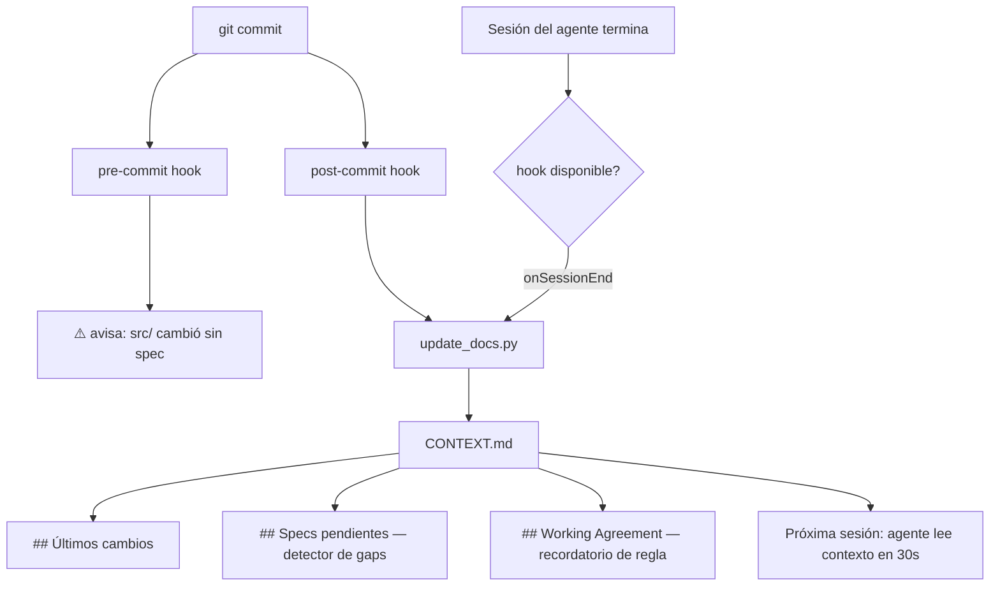
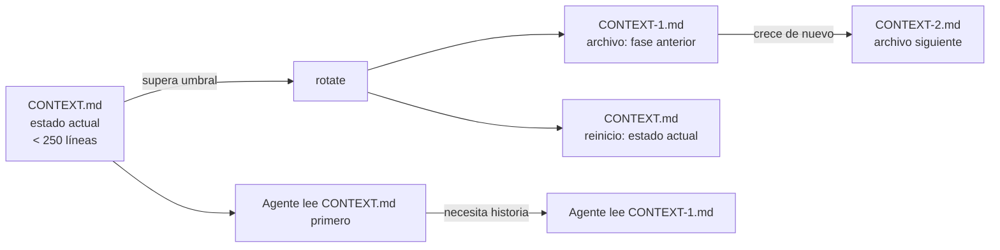

# Handoff Open Blueprint

> **Para que tu IA no empiece de cero en cada sesión.**

[](LICENSE)

---

## El problema

Cada vez que abres una nueva sesión con tu agente de IA, re-explicas el proyecto desde cero. El agente no sabe qué decisiones se tomaron, qué está hecho, qué está pendiente, ni qué no se debe tocar. Cada sesión es una pizarra en blanco.

## La solución

Un blueprint que hace tu repo **auto-documentado para la IA**. El agente lee los archivos al inicio de cada sesión y arranca en 30 segundos con el contexto completo del proyecto.

**Agnóstico al modelo.** Funciona con Claude, GPT, Gemini, Mistral, Copilot, Cursor, Llama — cualquier agente con ≥ 128k tokens de contexto real.

**Sin lock-in.** Sin extensiones requeridas, sin CLIs, sin suscripciones. Solo archivos Markdown y un script Python.

---

## Inicio rápido

```bash
git clone https://github.com/handoffcl/handoff-open-blueprint
cd handoff-open-blueprint
```

Luego en cualquier chat con tu agente de IA:

```
Lee BOOTSTRAP.md y ejecútalo.
```

El agente te pregunta tu idea, genera toda la estructura del proyecto y arranca.

---

## Cómo funciona

### El harness — infraestructura que se activa sola

`scripts/update_docs.py` no es solo un script — es el **harness** de tu flujo de desarrollo con IA.

Un harness envuelve las sesiones del agente con infraestructura que se activa automáticamente antes y después de cada acción:



Tres cosas se actualizan automáticamente en `CONTEXT.md` después de cada commit:
- **Últimos cambios** — commits clasificados (feat / fix / infra)
- **Specs pendientes** — archivos en `src/` modificados sin spec correspondiente
- **Working Agreement** — recordatorio de la regla para que el agente no olvide en sesiones largas

### Ingeniería de contexto — rotación progresiva

Un `CONTEXT.md` de 600 líneas desperdicia tokens. El harness rota automáticamente:



Configurable en `.blueprint` → `CONTEXT_ROTATE_LINES=250`

### Cómo evolucionan los docs solos

```
Tu commit
    │
    ▼ post-commit hook
    │
    ▼ update_docs.py actualiza:
    │   CONTEXT.md       → ## Últimos cambios  (últimos 8 commits clasificados)
    │   constitution.md  → ## Project Status   (fase, conteo de features)
    │   assumptions.md   → ## Last Review      (alerta de obsolescencia)
    │   plan/v1-mvp.md   → ## Build Progress   (commits totales, features)
    │   specs/*.md       → <!-- status -->      (in-progress / pending)

Próxima sesión: el agente lee los docs → contexto completo → arranca en 30s
```

**Principios del harness:**
- Nunca sobreescribe un archivo completo — reemplaza quirúrgicamente las secciones
- Crea stubs para cualquier doc faltante — funciona desde el commit 1
- Detecta la fase del proyecto: Exploratorio (< 20 commits) vs Estable (≥ 20 commits)

### Greenfield — funciona cuando partes de cero

Los blueprints tradicionales asumen que llegas con docs listos. Este no.

```
Día 1 — primer commit, sin docs
    │
    ▼ update_docs.py corre por primera vez:
    │   + constitution.md creado  (3 principios genéricos, Fase: Exploratorio)
    │   + assumptions.md creado   (tabla placeholder)
    │   + plan/v1-mvp.md creado   (sección ADR vacía)

Semana 2 — 15 commits, idea mutando
    │
    ▼ update_docs.py después de cada commit:
    │   ✓ constitution.md  → Fase: Exploratorio (15 commits)
    │   ✓ assumptions.md   → Last Review actualizado
    │   ✓ plan/v1-mvp.md   → 4 features, 6 fixes
    │   ✓ specs/*.md       → marcadores in-progress

Mes 2 — 50 commits, diseño estabilizado
    │
    ▼ update_docs.py:
    │   ✓ constitution.md  → Fase: Estable (50 commits)
    │   ✓ assumptions.md   → ⚠️ Sin actualizar en 30 commits — revísalo
```

Los docs no requieren disciplina manual. Arrancan mínimos y crecen con el producto.

---

## Archivos clave — qué hace cada uno

### `CONTEXT.md` — memoria viva del proyecto

**Qué cubre:** el estado actual del proyecto — qué está hecho, qué está en progreso, qué se decidió y por qué, qué no tocar.

**Qué ganas:** memoria continua entre sesiones. La sesión 50 arranca con el historial condensado de las sesiones 1 a 49. El agente no re-abre decisiones cerradas ni sugiere lo que ya descartaste.

**Qué pierdes sin él:** cada sesión empieza de cero. Pagas 10-15 minutos re-explicando el proyecto. El agente sugiere la alternativa que ya descartaste.

---

### `HANDOFF.md` — el reglamento del proyecto

**Qué cubre:** las reglas de operación del proyecto — convenciones de código, quality gate, estructura de carpetas, qué NO hacer, roles disponibles.

**Qué ganas:** cada sesión arranca con las reglas ya cargadas. El agente sabe tus convenciones, qué tests correr y qué archivos no tocar.

**Qué pierdes sin él:** re-explicas el proyecto cada sesión. El agente inventa convenciones que contradicen el resto del repo.

---

### `WORKING-AGREEMENT.md` — el protocolo de trabajo

**Qué cubre:** la regla central: analizar → proponer → esperar OK → escribir spec → codear. Aplica a cada cambio de código.

**Qué ganas:** control sobre lo que hace la IA antes de tocar cualquier cosa. Cada decisión deja un rastro en forma de spec que futuras sesiones pueden leer.

**Qué pierdes sin él:** la IA improvisa. Mezcla decisiones, inventa convenciones y deja deuda técnica que solo aparece semanas después.

---

### `docs/specs/` — un spec por feature, antes de codear

**Qué cubre:** el comportamiento esperado de cada feature — inputs, outputs, casos borde, restricciones.

**Qué ganas:** el agente implementa exactamente lo acordado. Sin scope creep, sin suposiciones.

**Qué pierdes sin él:** el agente adivina qué quieres. Cada sesión puede tomar una dirección distinta.

---

## Los roles

Antes de trabajar en cada área, el agente activa el rol correspondiente:

| Área | Rol | Cuándo usarlo |
|---|---|---|
| APIs, base de datos, servicios | `roles/senior-backend.md` | Feature backend, migración, refactor |
| Componentes, UX, accesibilidad | `roles/senior-frontend.md` | Feature frontend, nuevo componente |
| Flujos de usuario, diseño visual | `roles/senior-design.md` | Pantallas, onboarding, conversión |
| Auth, permisos, datos sensibles | `roles/security-review.md` | Cualquier cambio de seguridad — siempre |

Ver `roles/routing.md` para la guía completa.

---

## Modelos compatibles

| Contexto | Compatible | Modelos recomendados |
|---|---|---|
| < 128k tokens | ❌ No compatible | — |
| ≥ 128k tokens | ✅ Compatible | Llama 4 Scout, Claude Haiku, Mistral Large, GPT-5 Codex, GPT-5.x+ |
| ≥ 200k tokens | ✅ Ideal para proyectos con historial largo | GPT-5.x+, Claude Sonnet+, Qwen3-Coder 480B |

**Probados por el equipo:** Llama 4 Scout, Claude Haiku, GPT-5 Codex, GPT-5.x+, Qwen3-Coder 480B, Mistral Large
**No recomendados:** Mistral Codestral (contexto insuficiente en práctica)
**Compatibles por diseño** (ventana ≥ 128k, no verificados por el equipo): Gemini, DeepSeek, y cualquier modelo que soporte ≥ 128k en la práctica

> **Ojo:** algunos modelos anuncian 128k pero degradan calidad antes de ese límite. Para proyectos con historial extenso, usa modelos con ventana real de 200k+.

---

## Estructura del repo

```
handoff-open-blueprint/
├── BOOTSTRAP.md              ← punto de entrada — "ejecuta bootstrap"
├── WORKING-AGREEMENT.md      ← reglas de trabajo con la IA
├── LICENSE                   ← MIT
│
├── commands/
│   └── bootstrap.md          ← flujo completo de bootstrap (agnóstico)
│
├── roles/
│   ├── routing.md            ← cuándo usar cada rol según complejidad
│   ├── senior-backend.md
│   ├── senior-frontend.md
│   ├── senior-design.md
│   └── security-review.md
│
├── blueprint/                ← plantillas copiadas al proyecto en bootstrap
│   ├── CONTEXT.md.template
│   ├── HANDOFF.md.template
│   ├── WORKING-AGREEMENT.md.template
│   └── docs/
│       ├── specs/            ← un spec por feature, antes de codear
│       ├── vision/           ← qué hace el producto y para quién
│       ├── constitution/     ← principios del proyecto
│       ├── plan/             ← decisiones técnicas y ADRs
│       ├── clarify/          ← supuestos documentados
│       ├── modular/          ← contratos entre módulos
│       └── architecture/
│           └── contracts/    ← contratos OAS por módulo (generados en bootstrap)
│
└── scripts/
    ├── update_docs.py        ← harness: auto-actualiza docs después de cada commit
    └── install_hooks.sh      ← instala los git hooks
```

---

## ¿En qué se diferencia de handoff-blueprint?

[handoff-blueprint](https://github.com/handoffcl/handoff-blueprint) está diseñado para usarse con la extensión VS Code de Handoff — tiene slash commands y aprovecha la integración con el editor.

**handoff-open-blueprint** es la versión completamente agnóstica: funciona con cualquier agente, en cualquier editor, sin instalar nada adicional. Si no usas la extensión de Handoff, este es el que necesitas.

---

## Ecosistema Handoff

| Producto | Descripción |
|---|---|
| [Handoff](https://handoff.cl) | Chat multi-LLM con contexto compartido entre modelos |
| [Handoff VS Code Extension](https://handoff.cl/vscode) | El chat dentro de tu editor con herramientas de filesystem |
| [Handoff Blueprint](https://github.com/handoffcl/handoff-blueprint) | Blueprint para la extensión VS Code |
| **Handoff Open Blueprint** | Este repo — blueprint agnóstico para cualquier agente |
| [Handoff Coder](https://github.com/handoffcl/handoff-coder) | Modelfiles open source que convierten cualquier LLM en un ingeniero senior |

---

## Licencia

MIT — úsalo, forkéalo, mejóralo.

---

Hecho en Chile 🇨🇱 · [handoff.cl](https://handoff.cl) · [@handoffcl](https://github.com/handoffcl)
